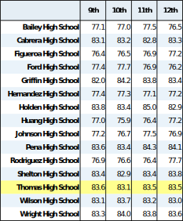
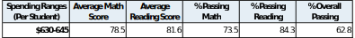
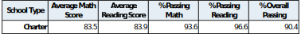

# **School District Analysis with pandas**

## **Overview of Project**
The goal of this analysis is to examine standardized test score data from all
high schools in a given school district to determine how well they performed.
Additionally, due to concerns about possible academic dishonesty, the analysis
is run twice: first with Thomas High School (THS) 9th grade test scores removed
and again on the entire student list. The goal is to create pandas DataFrames
that showcase the average scores and passing percentages for the district as a
whole and grouped by school, grade, spending range, school size, and shool type.
For each of the categories indicated, the two analyses are compared to evaluate
how eliminating THS 9th grade scores affects the results.

The raw data file [students_complete.csv](/resources/students_complete.csv)
contains student information as well as both math and reading test scores
collected from all students (9th through 12th grade). School information,
including name total budget, student population, and school type (charter or
district), is found in [schools_complete.csv](/resources/schools_complete.csv).
The work was completed via the Jupyter notebook script
[PyCitySchools_Challenge.ipynb](/PyCitySchools_Challenge.ipynb).

## **Analysis and Results**
First, the student data is cleaned to remove prefixes and suffixes that are not
valid. Next, using boolean indexing to filter the cleaned student DataFrame, the
9th grade test scores from THS were replaced with ```NaN```, effectively
removing their scores from the first analysis. For the DataFrames produced from
the *THS 9th Grade Scores Removed* data set, only the row of data that is
affected is shown in the sections below. The full DataFrames for this data set
can be seen in the script output. The DataFrames for the *Entire Student List*
data set are shown here in full.

The remaining content of this section is divided into subsections based on the
DataFrame of interest as follows:

#### **Section Links**

* [District Summary](#district-summary)
* [School Summary](#school-summary)
* [High Performing Schools](#high-performing-schools)
* [Low Performing Schools](#low-performing-schools)
* [Average Math Scores by Grade](#average-math-scores-by-grade)
* [Average Reading Scores by Grade](#average-reading-scores-by-grade)
* [Test Scores by Spending Range](#test-scores-by-spending-range)
* [Test Scores by School Size](#test-scores-by-school-size)
* [Test Scores by School Type](#test-scores-by-school-type)

>##### *Note. All of the average score and percentage categories below changed by some amount due to the removal of the 9th grade scores. For some of these, the change was small enough that it did not register as a difference in values in the tables due to rounding. Unless otherwise stated, these instances will be accepted as "unaffected by the removal of the scores."*
<br />

### **District Summary**
* The district summary looks at several statistics for the entire school
  district including: total schools, students, and budget as well as average
  scores for both tests and percentage passing for both tests and overall.
* *Average Math Score* decreased by 0.1 due to the removal of the 9th grade
  scores. *Average Reading Score* did not change.
* *% Passing Math*, *% Passing Reading*, and *% Overall Passing* all decreased
  by 0.2, 0.1 and 0.3 percentage points respectively.
* As would be expected, removal of suspected academically dishonest scores
  dropped the overall performance of the district.

#### *Entire Student List*
<div align="center">
    
</div>

#### *THS 9th Grade Scores Removed*
<div align="center">
    
</div>

##### [Back to Section Links](#section-links)

<br />
<hr />

### **School Summary**
* The school summary focuses on the same categories as the district summary on a
  per school basis. Additionally, the per student budget is included for later
  analysis of performance based on spending per student by each school.
* As expected, dropping 9th grade scores for THS only affects the performance
  results of THS in the per school summary.
* *Average Math Score* for THS decreased by 0.1. The average reading score did
  not change.
* *% Passing Math*, *% Passing Reading*, and *% Overall Passing* for THS all
  decreased by 0.1, 0.3 and 0.3 percentage points respectively.

#### *Entire Student List*
<div align="center">
    
</div>

#### *THS 9th Grade Scores Removed*
<div align="center">
    
</div>

##### [Back to Section Links](#section-links)

<br />
<hr />

### **High Performing Schools**
* THS made the high performing school list when using the entire student list.
  THS remained a high performing school even with the removal of the scores. In
  fact, THS retained the second highest overall passing rate (90.63%) of all
  schools.
* The changes to the data here are described in the **School Summary** section
  above.

#### *Entire Student List*
<div align="center">
    
</div>

#### *THS 9th Grade Scores Removed*
<div align="center">
    
</div>

##### [Back to Section Links](#section-links)

<br />
<hr />

### **Low Performing Schools**
* The lowest performing schools all had overall passing percentages in the low
  50's.
* This table is unaffected by the removal of the scores.

#### *Entire Student List*
<div align="center">
    
</div>

##### [Back to Section Links](#section-links)

<br />
<hr />

### **Average Math Scores by Grade**
* When averaging the math scores by grade, it is expected that removing 9th
  grade scores for THS will not affect the 10th-12th grade scores for THS (the
  note below the section links does not apply here). This is confirmed by the
  tables below.

#### *Entire Student List*
<div align="center">
    
</div>

#### *THS 9th Grade Scores Removed*
<div align="center">
    
</div>

##### [Back to Section Links](#section-links)

<br />
<hr />

### **Average Reading Scores by Grade**
* The expectation explained in the **Average Math Scores by Grade** section also
  holds here for reading scores. 10th-12th grade average scores for THS are
  unaffected.

#### *Entire Student List*
<div align="center">
    
</div>

#### *THS 9th Grade Scores Removed*
<div align="center">
    
</div>

##### [Back to Section Links](#section-links)

<br />
<hr />

### **Test Scores by Spending Range**
* THS's per student budget is $638.00 (see **School Summary**), therefore the
  *$630-645* row is used for comparison.
* The only categories affected are the *% Passing Reading* and *% Overall
  Passing*, both decreasing by 0.1 percentage points.

#### *Entire Student List*
<div align="center">
    
</div>

#### *THS 9th Grade Scores Removed*
<div align="center">
    
</div>

##### [Back to Section Links](#section-links)

<br />
<hr />

### **Test Scores by School Size**
* THS has 1,635 students (see **School Summary**), therefore the *Medium
  (1000-2000)* row is used for comparison.
* The only category affected is *% Passing Reading* which decreased by 0.1
  percentage points.

#### *Entire Student List*
<div align="center">
    
</div>

#### *THS 9th Grade Scores Removed*
<div align="center">
    
</div>

##### [Back to Section Links](#section-links)

<br />
<hr />

### **Test Scores by School Type**
* THS is a charter school (see **School Summary**), therefore the *Charter* row
  is used for comparison.
* All categories were unaffected by the removal of the scores.

#### *Entire Student List*
<div align="center">
    
</div>

#### *THS 9th Grade Scores Removed*
<div align="center">
    
</div>

##### [Back to Section Links](#section-links)

<br />

## **Summary**
In conclusion, the main affects of removing the THS 9th grade scores were to
decrease, almost across the board, the performance results of the district as a
whole and Thomas High School in particular. The overall passing percentage
underwent the biggest change, dropping by 0.3 percentage points for both the
district and THS. The results by school spending range also saw a decrease in
performance particularly in the reading and overall passing rates. Lastly, the
results by school size saw a decrease in the reading passing rate. Overall, all
changes in performance were less than a full percentage point owing to the fact
that the THS 9th grade population is small in comparison to the full THS student
population and certainly to the district wide student population.